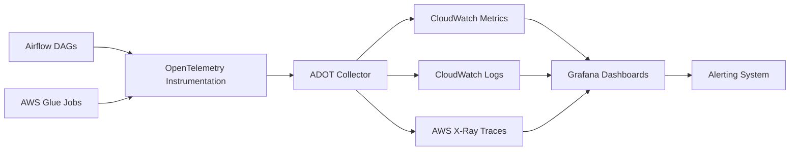
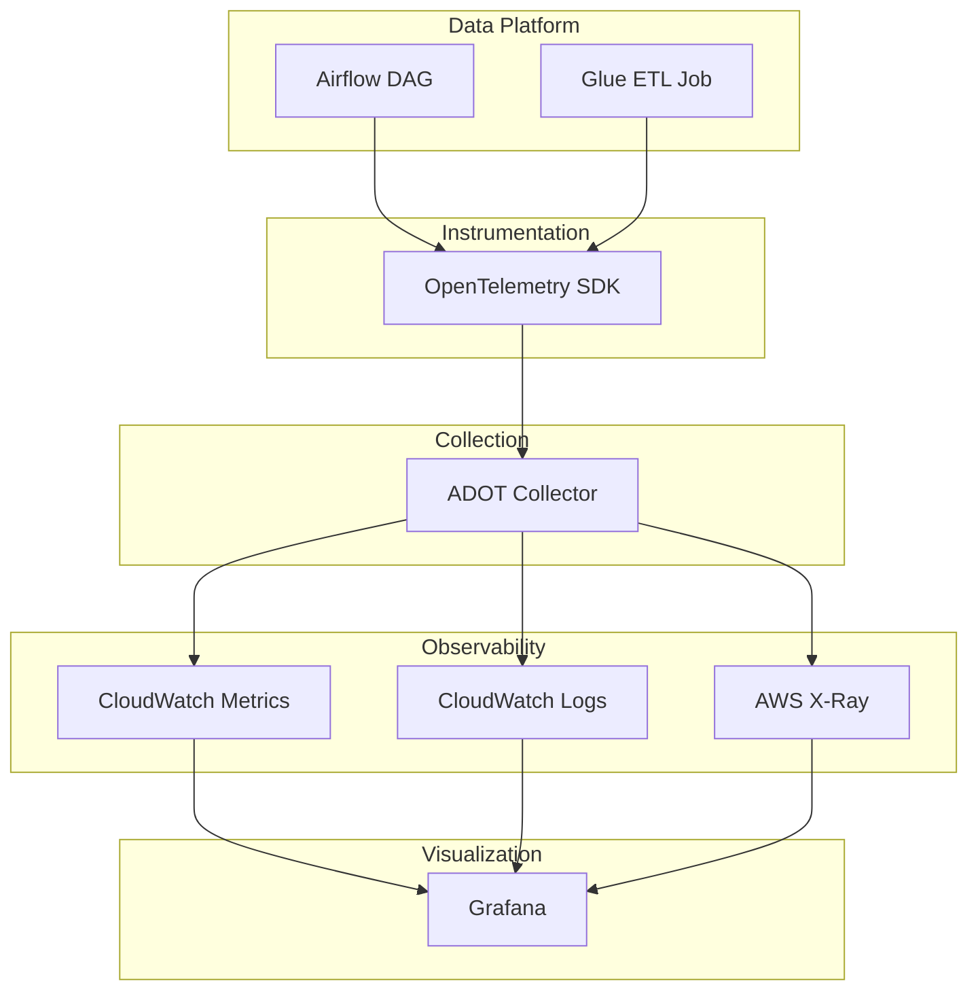
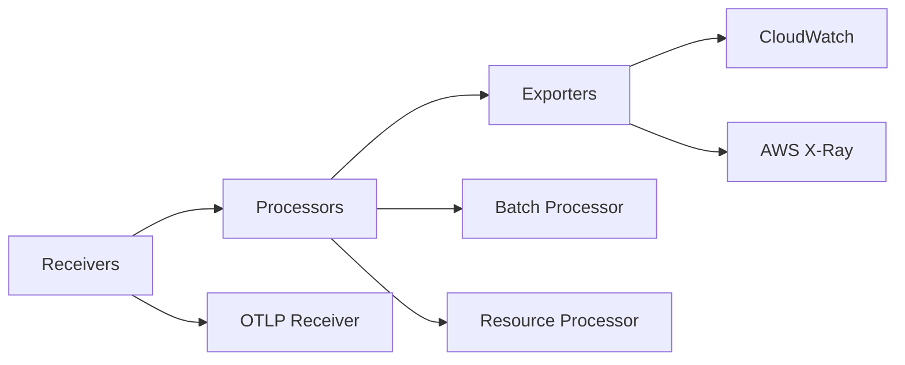
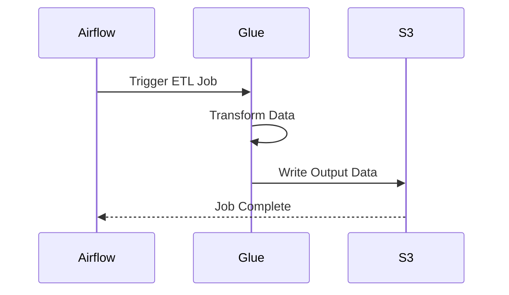

# Telemetry Framework
## Observability for Data Platform (ADOT + AWS Glue + Airflow)

---

# 1. Overview

Modern data platforms require strong **observability** to ensure reliability, performance monitoring, and rapid incident detection.

This repository documents the **Telemetry Framework** used to monitor the data pipeline ecosystem powered by:

- AWS Glue – ETL workloads
- Apache Airflow – workflow orchestration
- AWS Distro for OpenTelemetry (ADOT) – telemetry collection
- AWS CloudWatch – metrics and logs storage
- AWS X-Ray – distributed tracing
- Grafana – observability dashboards

The framework provides monitoring across three telemetry pillars:

| Signal | Description |
|------|------|
| Logs | Detailed system events |
| Metrics | Numeric system measurements |
| Traces | End-to-end execution visibility |

---

# 2. Objectives

The telemetry system enables:

- Pipeline health monitoring
- Real-time failure detection
- Performance monitoring
- Operational visibility
- Faster debugging
- SLA monitoring

---

# 3. High Level Architecture



---

# 4. Telemetry Architecture



---

# 5. Telemetry Data Model

| Field | Description |
|------|------|
| pipeline_name | Pipeline identifier |
| run_id | Unique execution ID |
| dag_id | Airflow DAG |
| task_id | Airflow task |
| job_name | Glue job |
| status | Success / Failure |
| timestamp | Event time |

Example structured log

```json
{
 "pipeline_name": "customer_pipeline",
 "run_id": "20260305_01",
 "component": "glue",
 "job_name": "transform_customer_data",
 "status": "SUCCESS",
 "duration_seconds": 542
}
```

---

# 6. AWS Glue Telemetry

| Metric | Description |
|------|------|
| glue_job_start | Job start |
| glue_job_duration | Execution duration |
| glue_job_success | Job success |
| glue_job_failure | Job failure |
| records_processed | Records processed |
| data_volume_processed | Data processed |

Example metric

```
pipeline.glue.job_duration = 540 seconds
```

---

# 7. Apache Airflow Telemetry

| Metric | Description |
|------|------|
| dag_run_total | Total DAG runs |
| dag_run_success | Successful runs |
| dag_run_failed | Failed runs |
| task_retry_count | Retry attempts |
| task_duration | Task execution time |

---

# 8. ADOT Collector Pipeline



Example configuration

```yaml
receivers:
  otlp:
    protocols:
      grpc:
      http:

processors:
  batch:

exporters:
  awsxray:
  awsemf:

service:
  pipelines:
    traces:
      receivers: [otlp]
      processors: [batch]
      exporters: [awsxray]

    metrics:
      receivers: [otlp]
      processors: [batch]
      exporters: [awsemf]
```

---

# 9. Metrics Taxonomy

## Pipeline Metrics

| Metric | Description |
|------|------|
| pipeline_runs_total | Total pipeline runs |
| pipeline_success_total | Successful runs |
| pipeline_failure_total | Failed runs |
| pipeline_duration_seconds | Execution duration |

## Data Metrics

| Metric | Description |
|------|------|
| records_processed | Processed data |
| records_failed | Error rows |
| data_quality_score | Validation metrics |

---

# 10. Distributed Tracing



Trace attributes

| Attribute | Description |
|------|------|
| span_id | Unique span |
| parent_span_id | Parent span |
| task_name | Execution task |
| duration | Execution time |
| status | Success / Failure |

---

# 11. Grafana Dashboard

| Panel | Description |
|------|------|
| Pipeline Runs | total executions |
| Pipeline Success | successful runs |
| Pipeline Failures | failed runs |
| Success Rate | success percentage |
| Pipeline Duration | runtime monitoring |

Success rate formula

```
success_rate =
pipeline_success_total /
(pipeline_success_total + pipeline_failure_total) * 100
```

---

# 12. Alerting Strategy

| Alert | Condition |
|------|------|
| Pipeline Failure | failure > 0 |
| High Duration | duration > SLA |
| Success Rate Drop | < 90% |
| Missing Pipeline | no run detected |

Example alert

```
pipeline_failure_total > 0
```

---

# 13. Incident Runbooks

## Glue Job Failure

1. Check CloudWatch logs
2. Identify error stack trace
3. Verify input data
4. Restart job
5. Notify data engineering team

## Airflow DAG Failure

1. Open Airflow UI
2. Identify failed task
3. Inspect logs
4. Retry task
5. Validate downstream tasks

---

# 14. Telemetry Validation

| Validation | Expected Result |
|------|------|
| Glue metrics emitted | CloudWatch |
| Airflow metrics emitted | Grafana |
| Traces generated | X-Ray |
| Dashboard populated | Real-time |
| Alerts triggered | Correct |

---

# 15. Security Considerations

- Avoid logging sensitive data
- Encrypt telemetry transmission
- Restrict dashboard access using IAM
- Monitor observability access logs

---

# 16. Benefits

- Proactive monitoring
- Faster root cause analysis
- Improved reliability
- Operational visibility
- Reduced downtime

---

# 17. Future Enhancements

- Anomaly detection
- ML based failure prediction
- Automated remediation
- Centralized observability platform

---

# 18. Conclusion

The telemetry framework provides comprehensive observability for the data platform by integrating:

- OpenTelemetry
- AWS Glue
- Airflow
- CloudWatch
- X-Ray
- Grafana

This ensures reliable monitoring through logs, metrics, and distributed tracing.
